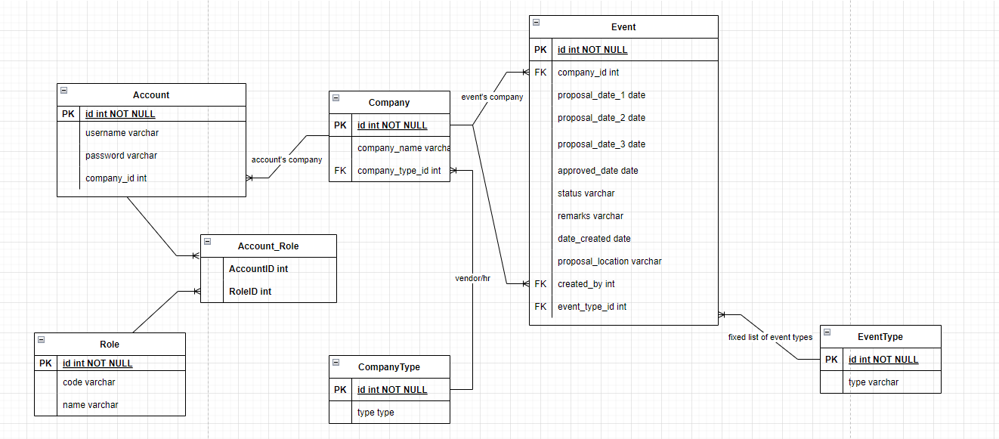

# MHC Demo

Demo project for MHC

## Description

A demo project to register for events.
There are a few things missing that I have yet to fix. 1 being the forms are not referring to the correct record in the UI. 
Another being the "remark" was not done as required in the document (sorry!).
I wanted to deploy to AWS (which I have done a few times) and write some unit tests as well but again I simply did not have enough time. 

## Getting Started

### Technical Overview
I've decided to use Spring's very own Thymeleaf to work on this project. It was just something I wanted to experiment on and I have many thoughts on the whole framework (mostly complaints). 

But that aside, I've used Spring Boot and a H2 in-memory database. I chose Spring Boot and H2 as I wanted a quick demo application without worrying too much on the bootstrapping and confguration.

The whole application is based on the traditional MVC model. I have also structured my project inspired by the CQRS pattern.

Another probably interesting note is that I've used webjars for this application. Its a great tool to bundle all the scripts and css in the compile and runtime of the application, which then 
allows you to create dynamic webpages without creating a separate module. It was a nightmare to configure alongside with Spring Security, as it blocks virtually everything. But it all worked out in the end.

Oh and most importantly I've used Spring Security for the user authentication. All api mapping, authentication configuration and bean injection will mostly be done in the WebSecurityConfig class. MvcConfig class helps to expose the static resources and jars for the UI to properly load.

Here's the ERD for the database design as well: 

### User Guide

Starting with the login. I have used a script to pre-populate some data in the h2 DB. Below are some users details. All account's passwords are "pwd". 

HR User 1
username: hr1

Vendor User 1
username: v1

Vendor User 2
username: v2

The login page is displayed as so. Key in the credentials to login:

And once you've keyed in the correct credentials, it redirects you to the dashboard page. Here you can add events (if you're a HR account) or view and edit events.

As you can see I've already populated the table with 1 record. You can click the _View_ button to view the corresponding event.

We can also click on the _Add new event_ button to add a new event. Here we filled up some details before submitting it. Note that all fields are made mandatory in this form. 

We can then click the _Log Out_ button on the top right of the page which would redirect us back to the login page. You should see a message on the top left of the page notifying that you have been logged out.
This time try logging in with the v1 user (Vendor User 1).

Next we should see the dashboard with 1 event (which is the event we just added with _hr1_ user. As a Vendor, I made the assumption that they should not be able to create events. Hence the _Add new event_ button is hidden. 

We can click the _View_ button to display the event. Here we see that we can approve or reject events. 

Select a date from the dropdown and enter some remarks if applicable (here is the part I missed to redirect to another pop-up). I will click _Approve_ here after entering a date.

All users are associated with a _Company_. Hence each user will only be able to see events if either 1 of the following 2 conditions are met:
 - The event is created by the user. 
 - The user belong to the assigned Vendor Company
 
 So here I signed in with HR User 1 (hr1). I create a new event and assign it to Vendor Company 2:
 
 

I then log out and log in again with the Vendor Company 1 (v1) user. After that we see that we can only see the single same event in the dashboard, which is what we approved earlier. The event has been assigned to Vendor 2 and will only be visible to a user assigned to the Vendor Company 2.

That's it! Hope that I have demonstrated and met at least most of the requirements. Let me know if you have any further questions/feedback. Happy to receive any thoughts.
